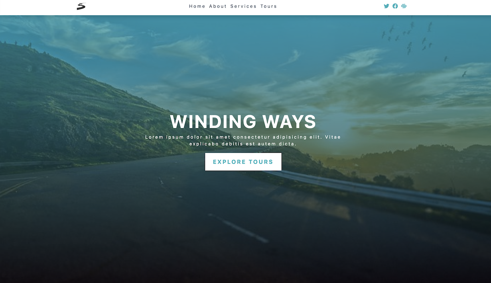

## Winding Ways

Refactored HTML pages transformed into a dynamic React application.

### Tech Stack
- `HTML`: The fundamental language used for structuring the web application's content and user interface. 
- `JavaScript`: Foundational programming language for creating responsive and interactive features.
- `React`: A powerful JavaScript library used to build the project.

### Explore the Website
[Winding Ways on Netlify](https://winding-ways.netlify.app/)

### Preview
